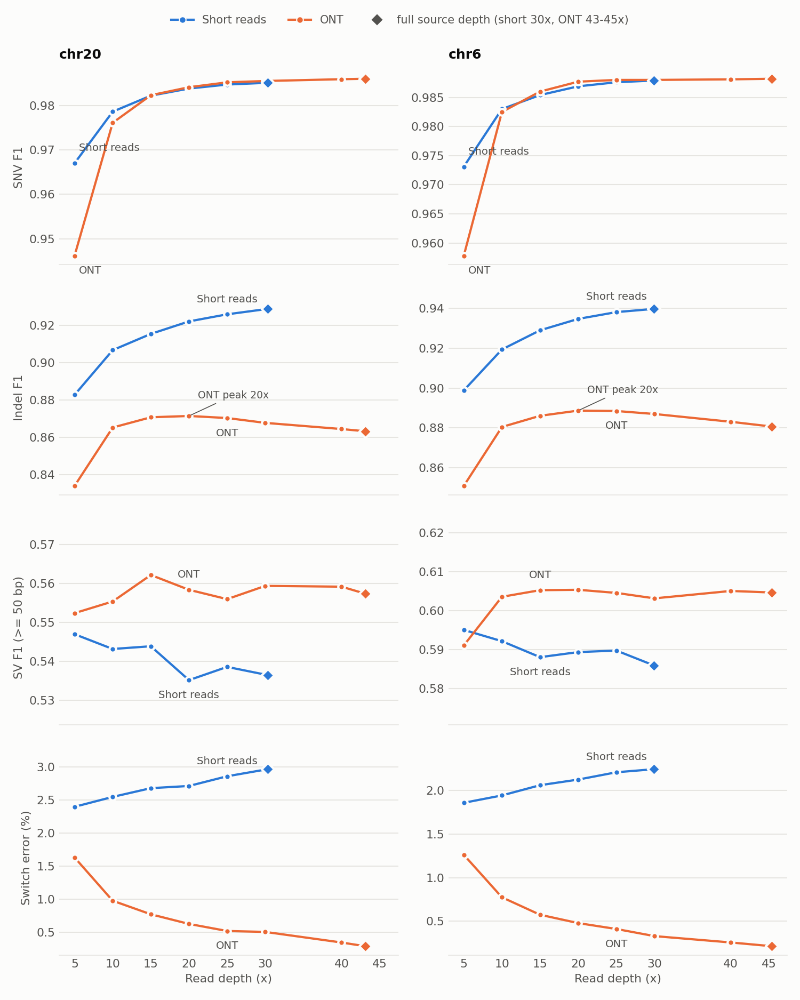
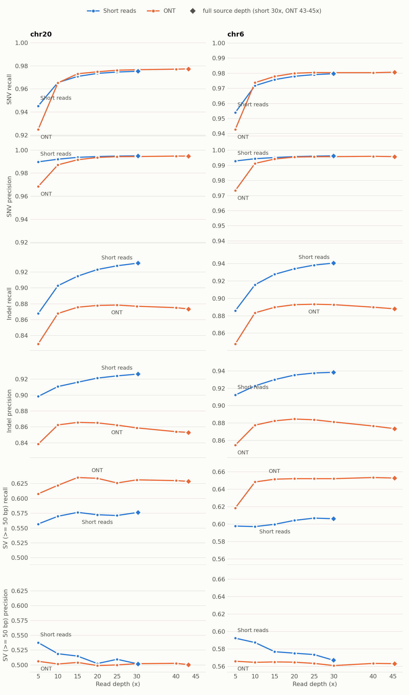

# Calling across coverage

How accuracy moves with read depth, for short reads and ONT, on chr20 and on chr6 held out. The
current-build sweep comes first; the August titration it replaces is kept below as a record, because it
is where GQN came from and its GQ-calibration results have not been re-measured.

## Current build: 5x to full depth (2026-09-23, vg `0cab3fbd4`)

### What was run

| technology | graph | contig | source depth | depths called |
|---|---|---|---|---|
| short reads (Illumina) | hap32: 32 sampled haplotypes (34 panel haplotypes with the CHM13 and GRCh38 paths) | chr20 | 30.28x | 5, 10, 15, 20, 25x, full |
| short reads | hap32 | chr6 | 29.9x | 5, 10, 15, 20, 25x, full |
| ONT (`--preset ont`) | E821: 16 sampled haplotypes (18 panel) | chr20 | 43.13x | 5, 10, 15, 20, 25, 30, 40x, full |
| ONT | E821 | chr6 | 45.42x | 5, 10, 15, 20, 25, 30, 40x, full |

**Short reads stop at their source depth.** The data is ~30x, and a 40x set cannot be made by
subsampling it; the top short-read point is the full read set, not a subsampled 30x.

- **Nested subsamples.** A read is kept at depth c when `crc32(name) / 2^32 < c / source`, so every
  shallower set is a subset of every deeper one and each step up the ladder is a paired comparison.
  Mates share a name and stay together.
- **One GAF-Base database per depth**, built against the whole graph. A `--gaf-reads` source has no
  fetch window and silently switches the depth term off, which is part of what depth changes.
- **The call line is the tier-2 arm's, flag for flag.** So the full-depth point *is* the tier-2 arm, and
  it is checked: for all four series the full-depth call reproduces the tier-2 arm's sites and genotypes
  exactly. The sweep measures depth and nothing else.
- **Scoring:** small variants by aardvark against T2T-Q100 (four-count F1: recall from truth
  true-positives, precision from call true-positives), SVs of at least 50 bp by truvari, phasing by
  `whatshap compare` against the phased T2T-Q100 truth (switches over assessed pairs of correctly
  genotyped hets).
- **Significance:** paired 1 Mb block bootstrap, 10,000 replicates, pooled over both contigs, on F1,
  recall and precision (`scripts/coverage/coverage_bootstrap.py`). Every interval quoted below comes
  from it.
- Runtimes are not reported: two series ran at once, so they are not serial costs.

<picture>
  <source media="(prefers-color-scheme: dark)" srcset="figures/coverage-curves-dark.png">
  
</picture>

*Diamonds mark the full read set. The SV panels span at least 0.05 so that differences of ~0.01, which
are not significant here, do not read as trends.*

<picture>
  <source media="(prefers-color-scheme: dark)" srcset="figures/coverage-recall-precision-dark.png">
  
</picture>

*The same runs split into recall and precision. Within a variant class and contig, the recall and
precision panels share one y-range, so the gap between them reads off the axis.*

### What it shows

**Short-read small variants improve all the way to full depth.** ALL F1 rises from 0.9485 to 0.9725 on
chr20 and from 0.9572 to 0.9774 on chr6; pooled over both contigs, 5x to full is **+0.0212**
[+0.0202, +0.0222]. Indel recall and precision both rise throughout. There is no plateau by 30x, so the
curve says nothing about where one would be.

**ONT small variants peak at 20-25x and then get worse.** Indel F1 is highest at 20x on both contigs
(0.8714 chr20, 0.8887 chr6) and falls to 0.8632 and 0.8807 at full depth: **-0.0081** [-0.0098, -0.0064]
pooled, and significant on each contig separately (chr20 -0.0082 [-0.0119, -0.0047], chr6 -0.0080
[-0.0099, -0.0061]). ALL F1 follows, peaking at 25x: 25x to full is
**-0.0015** [-0.0019, -0.0012]. The loss is mostly precision. Indel precision peaks at 15x on chr20
(0.8657) and at 20x on chr6 (0.8846). Pooled, 15x to full costs -0.0100 [-0.0125, -0.0074] of
precision against -0.0019 [-0.0037, +0.0001] of recall, which is not significant. Recall peaks at 25x
on both contigs and then falls as well, at half the rate (25x to full: recall -0.0052, precision
-0.0100). More reads lend support to ONT's systematic indel errors, mostly homopolymer miscounts,
rather than averaging them away (see [indel-uncertainty.md](indel-uncertainty.md)). SNV F1 still rises
to full depth. **Fixed since by `--hp-prior`**, a stronger panel prior at homopolymer-run indels that
`--preset ont` now sets: indel F1 rises at every depth to full on both contigs, +0.026 at 43x on
chr20 and +0.023 at 45x on held-out chr6 ([ont-hp-prior.md](ont-hp-prior.md)); the tables here are
from before it.

**Recall does most of the work of depth.** Pooled 5x to full, short-read SNV recall rises +0.0268
[+0.0255, +0.0281] against +0.0038 for precision, and indel recall +0.0572 against +0.0267. ONT
starts further back on precision as well: at 5x its SNV precision is 0.9684 (chr20) and 0.9733 (chr6),
against short reads' 0.9898 and 0.9929, and it gains +0.0415 recall and +0.0235 precision by full depth.
At 10x the ONT SNV deficit is all precision: -0.0036 [-0.0052, -0.0020] against short reads, with
recall level. From 15x ONT SNV recall runs about 0.002 above short reads (+0.0022 [+0.0008, +0.0038] at
15x, +0.0018 [+0.0005, +0.0034] at 20x). At full depth the gap is +0.0012 [-0.0001, +0.0028], an interval
that only just includes zero, and precision is level from 20x on.

**SV F1 is flat once past 10x.** ONT F1 is above short reads' at every depth from 10x on both
contigs (chr20 0.555-0.562 against 0.535-0.544; chr6 0.603-0.605 against 0.586-0.592). Pooled, that
F1 lead is not significant: +0.0193 [-0.0007, +0.0384] at full depth and +0.0115 [-0.0086, +0.0309] at
10x. What is significant is recall. ONT finds more SVs, +0.0484 [+0.0203, +0.0742] at full depth, at
precision no better than short reads' (-0.0032 [-0.0265, +0.0179]; at 10x short reads are ahead,
-0.0210 [-0.0441, -0.0005], an interval that only just excludes zero). F1 being flat does not mean its
parts are: ONT's own SV recall rises +0.0311 [+0.0229, +0.0394] from 5x to 15x, still +0.0065
[+0.0014, +0.0113] of it between 10x and 15x, and neither recall nor precision moves after 15x. At 5x on chr6 the short reads lead on
F1, 0.5951 against 0.5911.

**Short-read SV precision falls with depth.** The short-read F1 point estimates drift down (chr20
0.5470 to 0.5365, chr6 0.5951 to 0.5860), but 5x to full pooled is -0.0097 [-0.0210, +0.0020]:
**not significant**. Split into recall and precision, the drift is two opposing moves. Precision falls
significantly, -0.0293 [-0.0430, -0.0154] (chr20 0.5376 to 0.5017, chr6 0.5923 to 0.5670), and recall
rises by +0.0121 [-0.0053, +0.0259], which is not significant. Extra short reads add SV false positives
faster than they recover true SVs, and the same holds from 10x (precision -0.0190 [-0.0293, -0.0078],
recall +0.0082 [+0.0008, +0.0166]).

**Phasing goes opposite ways, for different reasons.** ONT switch error falls steadily with depth, from
1.64% to 0.29% on chr20 and 1.26% to 0.21% on chr6, because `--read-phasing` links hets through reads
that span them; it is still falling at full depth. Short-read phase comes from the haplotype panel, not
from reads, and its switch error *rises* with depth (2.40% to 2.97% chr20, 1.86% to 2.25% chr6). Most
of that rise is the denominator. At full depth, hets that are only genotyped correctly with enough reads
enter the assessment, and they are hard to phase: on chr20 the ~2,900 extra pairs run at about 12%
switch error. On an identical site set the rise is 2.33% to 2.48% (1,311 to 1,395 switches over 56,160
pairs).

**At low depth the technologies trade.** At 5x short reads call small variants better (SNV F1 0.967
chr20 and 0.973 chr6, against ONT's 0.946 and 0.958), ONT phases better at every depth, and by 15x ONT
SNV F1 is within 0.004 of its full-depth value on both contigs (0.9823 against 0.9860 on chr20, 0.9860
against 0.9882 on chr6). At 10x short reads are within about 0.01 ALL F1 of their full-depth value
on both contigs.

### Tables

#### Short reads (Illumina, 32-haplotype graph)

| contig | depth | median DP | ALL F1 | SNV R | SNV P | SNV F1 | indel R | indel P | indel F1 | SV R | SV P | SV F1 | switch % | pairs |
|---|---|---|---|---|---|---|---|---|---|---|---|---|---|---|
| chr20 | 5x | 5 | 0.9485 | 0.9453 | 0.9898 | 0.9670 | 0.8677 | 0.8983 | 0.8827 | 0.5569 | 0.5376 | 0.5470 | 2.40 | 56,687 |
| chr20 | 10x | 9 | 0.9627 | 0.9656 | 0.9921 | 0.9786 | 0.9027 | 0.9107 | 0.9067 | 0.5699 | 0.5189 | 0.5432 | 2.55 | 58,219 |
| chr20 | 15x | 14 | 0.9673 | 0.9709 | 0.9937 | 0.9822 | 0.9147 | 0.9161 | 0.9154 | 0.5765 | 0.5149 | 0.5439 | 2.68 | 58,633 |
| chr20 | 20x | 19 | 0.9700 | 0.9735 | 0.9944 | 0.9838 | 0.9230 | 0.9213 | 0.9221 | 0.5725 | 0.5023 | 0.5352 | 2.72 | 58,836 |
| chr20 | 25x | 24 | 0.9715 | 0.9747 | 0.9948 | 0.9847 | 0.9277 | 0.9241 | 0.9259 | 0.5712 | 0.5095 | 0.5386 | 2.86 | 59,002 |
| chr20 | **30.3x (full)** | 29 | 0.9725 | 0.9754 | 0.9950 | 0.9851 | 0.9311 | 0.9264 | 0.9288 | 0.5765 | 0.5017 | 0.5365 | 2.97 | 59,033 |
| chr6 | 5x | 5 | 0.9572 | 0.9540 | 0.9929 | 0.9731 | 0.8858 | 0.9122 | 0.8988 | 0.5979 | 0.5923 | 0.5951 | 1.86 | 158,090 |
| chr6 | 10x | 9 | 0.9692 | 0.9718 | 0.9944 | 0.9830 | 0.9158 | 0.9228 | 0.9193 | 0.5973 | 0.5873 | 0.5922 | 1.94 | 161,914 |
| chr6 | 15x | 14 | 0.9732 | 0.9758 | 0.9952 | 0.9854 | 0.9278 | 0.9300 | 0.9289 | 0.5999 | 0.5768 | 0.5881 | 2.06 | 163,048 |
| chr6 | 20x | 19 | 0.9755 | 0.9780 | 0.9958 | 0.9869 | 0.9341 | 0.9352 | 0.9346 | 0.6044 | 0.5751 | 0.5894 | 2.13 | 163,642 |
| chr6 | 25x | 24 | 0.9768 | 0.9791 | 0.9961 | 0.9876 | 0.9384 | 0.9376 | 0.9380 | 0.6070 | 0.5735 | 0.5898 | 2.21 | 163,942 |
| chr6 | **29.9x (full)** | 29 | 0.9774 | 0.9797 | 0.9963 | 0.9879 | 0.9407 | 0.9384 | 0.9396 | 0.6063 | 0.5670 | 0.5860 | 2.25 | 164,094 |

#### ONT (16-haplotype E821 graph, `--preset ont`)

| contig | depth | median DP | ALL F1 | SNV R | SNV P | SNV F1 | indel R | indel P | indel F1 | SV R | SV P | SV F1 | switch % | pairs |
|---|---|---|---|---|---|---|---|---|---|---|---|---|---|---|
| chr20 | 5x | 5 | 0.9210 | 0.9249 | 0.9684 | 0.9462 | 0.8296 | 0.8384 | 0.8339 | 0.6078 | 0.5061 | 0.5524 | 1.64 | 52,716 |
| chr20 | 10x | 9 | 0.9513 | 0.9653 | 0.9872 | 0.9761 | 0.8678 | 0.8625 | 0.8652 | 0.6222 | 0.5016 | 0.5554 | 0.98 | 57,411 |
| chr20 | 15x | 14 | 0.9573 | 0.9732 | 0.9916 | 0.9823 | 0.8757 | 0.8657 | 0.8707 | 0.6353 | 0.5042 | 0.5622 | 0.78 | 58,280 |
| chr20 | 20x | 19 | 0.9588 | 0.9749 | 0.9936 | 0.9841 | 0.8779 | 0.8651 | 0.8714 | 0.6340 | 0.4989 | 0.5584 | 0.63 | 58,586 |
| chr20 | 25x | 24 | 0.9593 | 0.9763 | 0.9943 | 0.9852 | 0.8784 | 0.8623 | 0.8703 | 0.6261 | 0.5000 | 0.5560 | 0.52 | 58,672 |
| chr20 | 30x | 29 | 0.9589 | 0.9767 | 0.9944 | 0.9855 | 0.8769 | 0.8588 | 0.8677 | 0.6314 | 0.5021 | 0.5594 | 0.51 | 58,758 |
| chr20 | 40x | 39 | 0.9584 | 0.9772 | 0.9948 | 0.9859 | 0.8751 | 0.8540 | 0.8644 | 0.6301 | 0.5027 | 0.5592 | 0.35 | 58,751 |
| chr20 | **43.1x (full)** | 42 | 0.9582 | 0.9774 | 0.9948 | 0.9860 | 0.8735 | 0.8531 | 0.8632 | 0.6288 | 0.5005 | 0.5574 | 0.29 | 58,743 |
| chr6 | 5x | 5 | 0.9347 | 0.9428 | 0.9733 | 0.9578 | 0.8476 | 0.8545 | 0.8510 | 0.6186 | 0.5659 | 0.5911 | 1.26 | 147,135 |
| chr6 | 10x | 10 | 0.9603 | 0.9738 | 0.9913 | 0.9825 | 0.8834 | 0.8775 | 0.8805 | 0.6484 | 0.5646 | 0.6036 | 0.77 | 158,025 |
| chr6 | 15x | 15 | 0.9643 | 0.9779 | 0.9942 | 0.9860 | 0.8898 | 0.8825 | 0.8861 | 0.6516 | 0.5651 | 0.6053 | 0.57 | 159,440 |
| chr6 | 20x | 20 | 0.9661 | 0.9800 | 0.9955 | 0.9877 | 0.8928 | 0.8846 | 0.8887 | 0.6522 | 0.5648 | 0.6054 | 0.48 | 160,017 |
| chr6 | 25x | 25 | 0.9663 | 0.9805 | 0.9957 | 0.9880 | 0.8933 | 0.8837 | 0.8885 | 0.6522 | 0.5634 | 0.6046 | 0.41 | 160,144 |
| chr6 | 30x | 30 | 0.9659 | 0.9804 | 0.9958 | 0.9880 | 0.8928 | 0.8812 | 0.8870 | 0.6522 | 0.5609 | 0.6032 | 0.33 | 160,108 |
| chr6 | 40x | 40 | 0.9652 | 0.9804 | 0.9960 | 0.9881 | 0.8899 | 0.8765 | 0.8831 | 0.6535 | 0.5634 | 0.6051 | 0.26 | 160,100 |
| chr6 | **45.4x (full)** | 45 | 0.9646 | 0.9807 | 0.9958 | 0.9882 | 0.8880 | 0.8735 | 0.8807 | 0.6529 | 0.5631 | 0.6047 | 0.21 | 160,078 |

### Caveats

- **Two graphs.** Short reads use a 32-haplotype panel and ONT a 16-haplotype one, so anything
  panel-dependent (allele enumeration, panel phasing) differs between the technologies as well as the
  reads. Compare within a technology across depth, and treat technology differences as indicative.
- **Phasing is not like-for-like either.** ONT combines read phasing with the panel; short reads use the
  panel alone. The assessed site set also grows with depth, as described above.
- **Truth coverage.** T2T-Q100 benchmark regions only; pericentromeres are barely represented.
- **Not re-measured on this build:** GQ and GQN calibration across depth, and the ploidy (chrX) series.
  The last measurement is the August titration below.

### Reproduce

`scripts/coverage/sweep.py` (subsample, build, call and score all four series; resumable),
`scripts/coverage/coverage_table.py > summary.tsv`, and
`scripts/coverage/plot_coverage.py summary.tsv docs/figures`. `scripts/coverage/coverage_table.py --md`
prints the tables above, and `scripts/coverage/coverage_bootstrap.py` the confidence intervals. This run used a pinned copy of the
binary (`--vg`).

## The August 2026 titration (record)

> **A dated record, not the current build.** Measured in August 2026, before genotypes were settled ahead
> of record construction (decide-then-render), before `--mismap-max` became 0.95 and before large snarls
> were genotyped rather than refused. Short reads only, on its own subsample sets (since deleted), with
> a haploid chrX series and a focus on GQ calibration. Its accuracy figures understate the current
> caller; the current sweep is above. It is kept because it is the measurement GQN was designed from.

Stage 0 of the coverage-robustness work. The point is to find out what breaks when the caller is
given less data than the ~30x diploid it was tuned on, and to decide -- from measurement rather
than from argument -- what a coverage- and ploidy-robust quality score should be.

The headline is a **negative result that redirects the design**: every simple depth rescale of GQ
makes the picture worse once both ploidies are in view, and ploidy turns out to be a much larger
source of miscalibration than depth.

### Method

Two series, one per ploidy:

| series | contig | ploidy | source | arms |
|---|---|---|---|---|
| diploid | chr20 | 2 | 30.28x | 5, 10, 15, 20, 25, 30x |
| haploid | chrX non-PAR | 1 | 14.63x | 2.5, 5, 7.5, 10, 12.5, 14.6x |

**The two series share an x-axis in reads per haplotype.** chr20 at 30.3x across two haplotypes is
15.1 per haplotype; a male chrX at 14.6x across one is 14.6. Choosing the chrX levels at half the
chr20 levels puts the series on a common axis, so a difference between them is ploidy and not
depth. That is the only reason two series are worth running.

**Subsampling is nested.** A read is kept at level c when `crc32(name)/2^32 < c/source`, so the 5x
set is a subset of the 10x set and so on. Independent draws per level would put sampling noise into
every pairwise comparison; nesting makes them paired, which turns out to matter (see the GQ scaling
correction below). Mates share a name in this GAF, so hashing the name keeps a pair together.

**A GAF-Base database per level, not `--gaf-reads` on the subsampled GAF.** An in-memory read
source answers exactly and so has no fetch window; `local_read_rate` returns 0 for a window-less
source and the depth term switches itself off rather than inventing a rate. Titrating that way
would have measured a model with `--depth-term` silently disabled -- one of the very parameters
under study.

Reproduce with `scripts/coverage/{subsample_gaf,titrate,bench_coverage,normaliser_eval}.py|sh`.

**Controls.** The full-coverage arms reuse the whole-genome reads database, so they must reproduce
published numbers. chr20 at 30x gives ALL F1 **0.9645** against the published tier-2 `readlik`
**0.9645**; chrX at 14.6x gives **0.9362** against the whole-genome run's **0.9362**. Both exact.

**Range caveat.** The source data is 30.3x, so this covers 5-30x. The 30-40x end of the intended
range is extrapolation, not measurement.

### 1. Accuracy degrades gracefully, and differently by ploidy

| chr20 | medDP | ALL F1 | SNV F1 | Indel F1 | recall | precision |
|---|---|---|---|---|---|---|
| 5x | 5 | 0.9008 | 0.9224 | 0.8225 | 0.8414 | 0.9693 |
| 10x | 10 | 0.9419 | 0.9600 | 0.8772 | 0.9106 | 0.9754 |
| 15x | 14 | 0.9546 | 0.9709 | 0.8971 | 0.9329 | 0.9774 |
| 20x | 19 | 0.9609 | 0.9755 | 0.9096 | 0.9430 | 0.9795 |
| 30x | 29 | 0.9645 | 0.9781 | 0.9177 | 0.9495 | 0.9801 |

| chrX | medDP | ALL F1 | SNV F1 | Indel F1 | recall | precision |
|---|---|---|---|---|---|---|
| 2.5x | 2 | 0.8471 | 0.8852 | 0.7299 | 0.8113 | 0.8863 |
| 5x | 5 | 0.9097 | 0.9381 | 0.8217 | 0.9081 | 0.9114 |
| 7.5x | 7 | 0.9248 | 0.9458 | 0.8591 | 0.9247 | 0.9249 |
| 10x | 9 | 0.9311 | 0.9479 | 0.8779 | 0.9300 | 0.9322 |
| 14.6x | 14 | 0.9362 | 0.9499 | 0.8928 | 0.9335 | 0.9389 |

**Low coverage costs a diploid contig recall and a haploid contig precision.** chr20's precision
barely moves across the whole range (0.9693 to 0.9801) while recall runs 0.8414 to 0.9495. chrX
loses both, and its precision falls to 0.8863. This is the same asymmetry the chrX investigation
found at full depth (see `wgs-results.md`): under ploidy 1 a balanced pileup has no genotype that
explains it, so the model must pick one allele and produces a coin-flip call. Less depth makes
balanced pileups commoner, so haploid calling converts missing evidence into false positives where
diploid calling converts it into missing calls.

### 2. The GQ scaling law, and a correction worth keeping

Compared **across arms**, median het GQ per unit depth looks strongly superlinear on chr20 -- 2.00
at 5x rising to 3.79 at 30x, nearly a doubling. That reading is wrong, and the way it is wrong is
instructive: the median at each coverage is taken over a *different population*, because which
sites get called het changes with depth.

Paired on **identical sites** -- which the nested subsampling makes possible, the same site seen
with fewer reads rather than a different site -- the ratio is nearly flat:

| chr20, paired | 5x | 10x | 15x | 20x | 25x | 30x |
|---|---|---|---|---|---|---|
| median GQI | 16 | 30 | 50 | 70 | 91 | 113 |
| GQI / DP | 3.20 | 3.00 | 3.33 | 3.50 | 3.64 | 3.77 |

So the likelihood gap is close to linear in depth, with about 18% residual drift rather than 90%.
The scaling that is not an artifact is the **256 clamp**: it censors 0.2% of diploid calls at 30x
but **23.3% of haploid calls** at full depth. Anything normalising GQ must therefore be computed
inside the caller, on the uncensored gap, not derived from the VCF.

### 3. GQ is miscalibrated, and not because the callsets differ

Observed precision at a claimed GQ, chr20:

| cov | GQ 0-5 | 5-10 | 10-20 | 20-40 | 40-80 |
|---|---|---|---|---|---|
| 5x | 0.901 | 0.968 | 0.983 | 0.993 | 0.995 |
| 15x | 0.820 | 0.877 | 0.943 | 0.986 | 0.995 |
| 30x | 0.730 | 0.775 | 0.835 | 0.909 | 0.984 |

**The same GQ is more reliable at low coverage than at high**, which inverts the intuition. It
makes sense on reflection: at 5x a low GQ means under-powered but usually right, while at 30x a
call still marginal after 29 reads means the evidence actively conflicts -- the collapsed-paralog
signature. The two encode different kinds of uncertainty under one number.

This is not a population artifact. Restricted to the 91,106 sites called in *all six* arms the
fan-out survives almost unchanged (GQ 0-5: 0.912 at 5x against 0.755 at 30x).

The same table on chrX fans out further and sits far lower: GQ 0-5 runs 0.253 at 2.5x down to
0.110 at 14.6x. A low-GQ haploid call is almost always wrong at any coverage, where the same GQ on
a diploid contig is right 73-90% of the time.

### 4. The negative result: no simple depth rescale works

Mean precision spread across arms, lower being better calibrated:

| series | raw GQ | GQ / DP | GQ / sqrt(DP) |
|---|---|---|---|
| chr20 (diploid) | 0.101 | **0.050** | 0.083 |
| chrX (haploid) | 0.150 | 0.161 | **0.071** |
| **POOLED across ploidies** | **0.348** | 0.496 | 0.423 |

`GQ/DP` halves the spread on the diploid series and is the obvious answer if that is all you look
at. It is slightly worse on the haploid series, and **substantially worse pooled** -- it removes
the depth axis, leaves the larger ploidy axis untouched, and compresses the score range so the
ploidy gap does more damage. At a matched `GQ/DP` bucket the two ploidies sit about 0.6 apart in
precision (chr20 0.75-0.95, chrX 0.14-0.25).

Validating on chr20 alone would have shipped a field that degrades what it exists to fix. **The
pooled row is the acceptance test for any candidate**; nothing that fails it is a fix, however good
it looks on one contig.

Why ploidy dominates: at ploidy 1 the runner-up genotype is a different allele outright, so every
read discriminates fully. At ploidy 2 a het's runner-up differs on a single strand, so a read
discriminates roughly half as much. The per-read gap scale is a function of ploidy, and `1/DP`
cannot see it.

### What this changes

- **Stage 1** cannot be a rescale of GQ by depth. The remaining principled candidate is to divide
  the observed gap by the gap *achievable* at that site -- what a noise-free pileup would give
  under this site's lambda, ploidy and allele set -- which is ploidy-aware by construction. It
  needs the per-read likelihood matrix, so design it offline from `vg call --dump-likelihoods`
  before writing any C++, the way the depth-implausibility discount was designed.
- **Stage 3** must gate on that field and never on raw GQ. A gate tuned at 30x diploid would
  discard, at 5x, a population of calls that is 90% correct.
- **Stage 2** gains support: the residual low-end spread that survives normalisation is the
  conflicting-evidence population, which is what the allele-balance and `ploidy_conflict` signal
  targets directly rather than by rescaling.
- **Stage 5** re-tuned the three model parameters across coverage. See below.

### Stage 5: are the defaults still right at other coverages?

Each of `--linkage-weight`, `--linkage-freq-prior` and `--depth-term` was swept around its shipped
default at four corners -- low and high coverage at each ploidy -- with everything else left alone.
A coordinate sweep rather than a grid, because the defaults were fitted one at a time and the
question is whether each still holds elsewhere.

**Read the gain column, not the argmax.** An optimum a few ten-thousandths better on one arm is
noise plus a different arm; changing a default on that basis would invalidate every published
number for nothing.

#### `--linkage-weight` (default 2)

| arm | 0 | 1 | 2 | 4 | 8 | best | gain |
|---|---|---|---|---|---|---|---|
| chr20 5x | 0.8546 | 0.8998 | **0.9008** | 0.9002 | 0.8987 | 2 | +0.0000 |
| chr20 30x | 0.9546 | 0.9643 | 0.9645 | **0.9646** | 0.9637 | 4 | +0.0001 |
| chrX 2.5x | 0.8471 | **0.8637** | 0.8609 | 0.8595 | 0.8593 | 1 | +0.0028 |
| chrX 14.6x | 0.9362 | **0.9438** | 0.9421 | 0.9417 | 0.9418 | 1 | +0.0018 |

**The prediction that optimal weight rises as coverage falls is refuted.** It is flat at 2 on the
diploid arms and sits at 1 on the haploid ones, with gains over the default between 0.0000 and
0.0028. The default stands.

The valuable column is `0`: linkage is worth **+0.046** at 5x diploid and **+0.017** at 2.5x
haploid, so the layer earns its place at low coverage even though its weight does not need tuning.

This sweep is also what exposed the [haploid linkage bug](#a-bug-this-sweep-found).

#### `--linkage-freq-prior` (default 5)

| arm | 0 | 3 | 5 | 8 | best | gain |
|---|---|---|---|---|---|---|
| chr20 5x | 0.8960 | **0.9021** | 0.9008 | 0.8981 | 3 | +0.0012 |
| chr20 30x | 0.9593 | 0.9631 | 0.9645 | **0.9649** | 8 | +0.0003 |
| chrX 2.5x | 0.8561 | **0.8613** | 0.8609 | 0.8601 | 3 | +0.0005 |
| chrX 14.6x | 0.9385 | 0.9406 | 0.9421 | **0.9445** | 8 | +0.0024 |

**This is the one real coverage trend**, and it is consistent: low coverage prefers 3, high
coverage prefers 8, on *both* ploidies. Replication across ploidy is what makes it credible rather
than four independent argmaxes.

The direction is the opposite of the intuition behind the linkage-weight prediction. A stronger
frequency prior pulls calls toward alleles the panel carries often; where the reads are weak that
overrides them and costs rare true variants, so the prior should be *weaker* at low coverage, not
stronger.

The effect is nonetheless small -- at most 0.0024, and the default of 5 is never more than that
from the best value on any arm.

#### `--depth-term` (default 0.1)

| arm | 0 | 0.05 | 0.1 | 0.2 | best | gain |
|---|---|---|---|---|---|---|
| chr20 5x | 0.9007 | 0.9008 | 0.9008 | 0.9008 | 0.1 | +0.0000 |
| chr20 30x | 0.9646 | 0.9646 | 0.9645 | 0.9645 | 0 | +0.0000 |
| chrX 2.5x | **0.8614** | 0.8609 | 0.8609 | 0.8608 | 0 | +0.0005 |
| chrX 14.6x | 0.9421 | 0.9420 | 0.9421 | 0.9421 | 0 | +0.0001 |

Flat to four decimals across the whole range at every coverage. On small variants the term does
essentially nothing, which is expected -- it exists for large deletions, where absent reads are the
evidence, and those are a small share of an F1 dominated by SNVs. This sweep says nothing about
that case and should not be read as doing so.

#### The decision: neither auto-scaling nor a table

The plan left open whether to auto-scale parameters from the measured coverage or to ship a
documented table. **Neither is justified.** Two of the three parameters have optima that do not
move with coverage at all, and the third moves by at most 0.0024 F1 -- less than the spread between
adjacent values at a single coverage.

Auto-scaling would make a run's behaviour depend on its own data in a way that is hard to explain
and hard to reproduce, and it would buy under 0.003. A table would ask users to look something up
for the same. The defaults stay, and what is documented instead is the shape: `--linkage-freq-prior`
3 is worth about 0.001 below 10x and 8 is worth about 0.002 above 15x, for anyone who wants it.

#### A bug this sweep found

chrX returned *identical* F1 at every `--linkage-weight`, and the VCFs were byte-identical, while
chr20's moved. But `--progress` reported 8,945 genotypes changed.

`apply_linkage_change` built the genotype it expected as `"i/j"`, which a haploid record's bare
allele can never match, so its guard rejected every haploid change. The linkage layer had been
doing the work on haploid contigs and discarding all of it -- and since phasing and the mosaic are
built from the post-linkage genotypes, the mosaic described genotypes the VCF did not contain.

Fixed in vg at the time. `apply_linkage_change` itself no longer exists -- the record is now built
from the settled genotype, so there is no line to patch and no guard to get wrong; see
`planning/decide-then-render.md`. The account above is kept because the failure mode it names,
a silent no-op that the progress counter reported as work done, is not specific to that function.
**Haploid linkage is worth +0.017 F1 at 2.5x and
+0.008 at 14.6x**, none of which chrY or non-pseudoautosomal chrX was receiving.

Three points of method, all learned the hard way in this stage:

- A resume marker that skips completed work is wrong for a sweep. The fix landed mid-sweep and the
  marker kept the pre-fix chrX arms, which then scored as though they were the fixed caller and
  were identifiable only by their file timestamps. `sweep_params.sh` now reuses a result only if it
  is **newer than the vg binary** -- a sweep measures a build, so a result from an older build is
  an answer to a different question.
- The same applies to the scoring cache. `bench_coverage.py` and `sweep_report.py` reuse a
  `.renamed.vcf.gz` if one exists, which will happily re-score a deleted-and-regenerated VCF's
  stale twin.
- In zsh, one non-matching glob aborts the whole `rm`, so a cleanup command that looks like it ran
  may have done nothing. Use `find -delete` and check.
