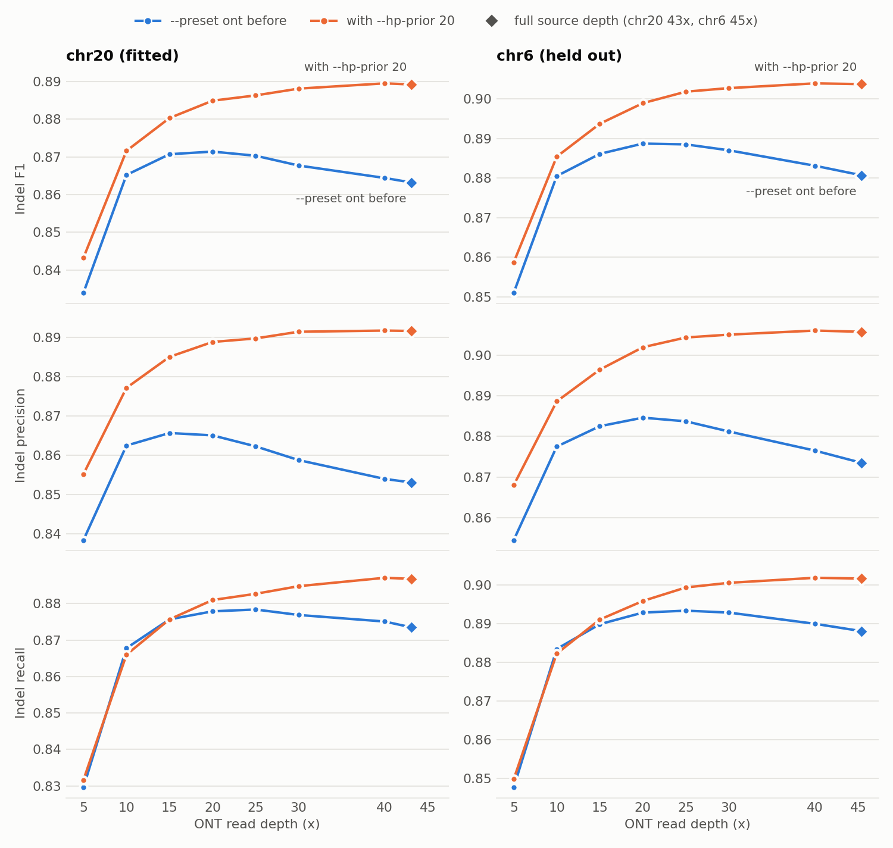

# A stronger panel prior at homopolymer runs (`--hp-prior`)

> **Measured 2026-09-24.** A change to `vg call` on top of `76088723b` (branch `snarl-tree-order`):
> two flags, `--hp-prior F` and `--hp-prior-run N`, with `--preset ont` setting `--hp-prior 20`.
> Fitted on ONT chr20 from 5x to 43x; chr6 held out throughout. Genome-wide: ONT indel F1 +0.0234,
> every autosome up, SNVs and SVs unchanged, no added cost. Short reads are byte-identical.

## What was wrong

The coverage titration ([coverage.md](coverage.md)) found that ONT indel F1 **peaked at 20x and
then fell** to full depth, pooled over chr20 and chr6 by -0.0081 [-0.0098, -0.0064], mostly through
precision. More reads made the caller worse.

The whole decline sits in one cell: **indels in reference homopolymer runs of 11 bp or more**. That
cell's F1 peaks near 10x and falls; every other indel class improves all the way to full depth.
From 20x to full depth on chr20, false positives in that cell rise by 489 while all other indel
false positives fall by 168, and chr6 shows the same curve.

The mechanism is independence. ONT miscounts long runs in a way that belongs to the site rather
than the read, so the reads' votes there are correlated -- but the read model multiplies them as if
they were not, so its margin grows linearly with depth. The panel's allele-frequency prior
(`--linkage-prior`, exponent 5) is a fixed number of nats. Past 10-20x the reads outvote the panel,
and in this cell the panel had the better answer: **45% of the false heterozygous indels there are
alleles 2 or fewer of the 18 panel haplotypes carry, against 3-4% of the true ones.**

It is not a low-allele-fraction effect. The false positives gained with depth look like balanced
heterozygotes (median alternate-read fraction 0.63), and filters on allele fraction or GQ lose F1 at
every threshold tried.

## The change

At a site where the **reference allele and another differ by a pure change in the length of one
homopolymer run** -- the same base, 1 to 49 bp of it, inserted or deleted -- in a run of at least 11
bases, the linkage decode uses a frequency exponent of **20** in place of `--linkage-prior` (5).
Nothing else changes, and no SNV site is in scope.

Three decisions, each measured:

- **The run is measured inside the alleles, and a run that reaches into a snarl boundary node counts
  as long.** This graph cuts a long homopolymer into a chain of small snarls whose boundary nodes are
  often a single base, so a run measured inside the alleles alone read short at 40% of the sites in
  scope, and the feature delivered 60% of its gain. Treating a run that touches either end of the
  allele as long recovers all of it -- in emulation, 0.8907 at 43x on chr20 against 0.8910 for a
  walk along the reference beyond the snarl -- without reading the reference path.
- **Only pairs that include the reference allele count.** Comparing every pair also put structural
  insertions in scope whose alternate alleles differ by a few bases of poly-A tail, which the fit
  never covered.
- **The exponent is fixed, not scaled with depth.** In scope, 20 is the best value at every depth to
  25x; above that the optimum drifts towards 40. Letting the exponent rise with the site's reads
  (`20 x max(1, reads / 20)`) bought +0.0016 at 43x [-0.0001, +0.0032], trading recall for precision,
  and +0.0009 at 30x and 40x, none significant -- not worth a flag and a depth law.

## Fitted on chr20

The prior's exponent in scope, by snarl-merge emulation (in-scope snarls from a run at that
exponent, the rest from the baseline; indel F1):

| exponent | 5x | 10x | 15x | 20x | 25x | 30x | 40x | 43x |
|---|---|---|---|---|---|---|---|---|
| 5 (the default) | 0.8339 | 0.8652 | 0.8707 | 0.8714 | 0.8703 | 0.8677 | 0.8644 | 0.8632 |
| **20** | **0.8433** | **0.8715** | **0.8802** | **0.8848** | **0.8865** | 0.8882 | 0.8892 | 0.8888 |
| 30 | 0.8427 | 0.8705 | 0.8796 | 0.8841 | 0.8864 | **0.8885** | 0.8907 | 0.8911 |
| 40 | 0.8419 | 0.8693 | 0.8785 | 0.8825 | 0.8854 | 0.8881 | **0.8908** | **0.8913** |
| 60 | 0.8407 | 0.8680 | 0.8768 | 0.8813 | 0.8845 | 0.8870 | 0.8896 | 0.8901 |

A stronger exponent applied everywhere instead costs SNVs (exponent 20 globally: SNV F1 -0.0068 at
20x), so it has to be scoped. The implementation reproduces the emulation: 0.8849 at 20x against
0.8848, and 0.8892 at 43x against 0.8888.

## Held out on chr6

<picture>
  <source media="(prefers-color-scheme: dark)" srcset="figures/ont-hp-prior-dark.png">
  
</picture>

Indel F1, `--preset ont` before and after, with the change's paired 1 Mb block-bootstrap interval:

| chr20 (fitted) | 5x | 10x | 15x | 20x | 25x | 30x | 40x | 43x |
|---|---|---|---|---|---|---|---|---|
| before | 0.8339 | 0.8652 | 0.8707 | 0.8714 | 0.8703 | 0.8677 | 0.8644 | 0.8632 |
| after | 0.8432 | 0.8716 | 0.8803 | 0.8849 | 0.8863 | 0.8881 | 0.8895 | 0.8892 |
| change | +0.0093 | +0.0064 | +0.0097 | +0.0135 | +0.0160 | +0.0204 | +0.0250 | **+0.0260** |

| chr6 (held out) | 5x | 10x | 15x | 20x | 25x | 30x | 40x | 45x |
|---|---|---|---|---|---|---|---|---|
| before | 0.8510 | 0.8805 | 0.8861 | 0.8887 | 0.8885 | 0.8870 | 0.8831 | 0.8807 |
| after | 0.8587 | 0.8854 | 0.8937 | 0.8989 | 0.9018 | 0.9027 | 0.9039 | 0.9037 |
| change | +0.0077 | +0.0049 | +0.0076 | +0.0102 | +0.0133 | +0.0158 | +0.0208 | **+0.0230** |

Every change is significant; the smallest lower bound is chr6 10x, [+0.0035, +0.0064]. At 45x on chr6
the gain is +0.0230 [+0.0210, +0.0250], recall +0.0136 and precision +0.0323 both up.

**The decline is gone.** The 20x-to-full-depth indel slope, which was -0.0080 on chr6, is now
+0.0048 [+0.0034, +0.0062]; pooled over both contigs it is +0.0047 [+0.0035, +0.0059].

## What did not move

- **SNVs.** SNV F1 moves by at most 0.0007 at any depth on either contig, and is unchanged to four
  decimals at full depth on both. ALL F1 rises with the indels: +0.0054 at 45x on chr6.
- **Structural variants.** truvari SV F1 moves by +0.0015 at most (chr20 20x) and by -0.0000 to
  +0.0004 elsewhere at 20x and full depth.
- **Phasing.** On the heterozygous sites both runs genotype identically, switch error at full depth
  is the same to the switch: 164 against 164 on chr20, 314 against 314 on chr6; at 20x it moves by
  +4 and +9 switches in about 58,000 and 160,000 pairs. The plain rate rises slightly at full depth
  (chr20 0.293% to 0.323%) because the switch-error comparison only assesses sites genotyped
  correctly, so newly correct heterozygous calls in homopolymer runs join the assessed set, and they
  are harder to phase.
- **Short reads.** The change is preset-only. At its defaults the new binary writes a VCF
  byte-identical to the old one, and identical stderr apart from timings and thread-scheduled
  counters, for short reads on chr20 at 20x and full depth and on chr6 at full depth, and for ONT
  with the flag off at 20x, full depth and 20x with `-A`.

## Genome-wide

All 24 contigs of ONT at full depth (~44x) with the new binary under `--preset ont`, against the
2026-09-24 ONT genome run on `0cab3fbd4` ([wgs-results.md](wgs-results.md)), reusing its read
databases (`work/wgs-ont-hp`). The genome run's chr20 has exactly the sites and genotypes of the
tier-2 chr20 arm above.

| chr1-22+X, ONT | before | `--hp-prior 20` | change, 95% CI |
|---|---|---|---|
| ALL F1 | 0.9591 | **0.9648** | **+0.0057** [+0.0055, +0.0059] |
| SNV F1 | 0.9853 | 0.9853 | +0.0000 [-0.0000, +0.0000] |
| Indel F1 | 0.8684 | **0.8918** | **+0.0234** [+0.0227, +0.0240] |
| SV >=50 bp F1 | 0.5820 | 0.5820 | -0.0000 [-0.0003, +0.0002] |

Paired 1 Mb block bootstrap (`work/wgs-run/wgs_compare.py`). With chr20 and chr6 -- the fitted and
the held-out contig -- both left out, indels gain +0.0233 [+0.0226, +0.0240]. **Every autosome
improves**, from +0.0106 (chr9) to +0.0302 (chr17). Indel precision rises from 0.8598 to 0.8960 and
recall from 0.8772 to 0.8876. On the autosomes: ALL 0.9650, SNV 0.9854, indel 0.8920, SV 0.5834.

The change costs nothing measurable: 14.18 h of CPU over the 24 contigs against 14.31 h.

**Against the other callers**, on chr1-22+X:
- ONT now leads **PanGenie in every class**, indels included: +0.0201 [+0.0185, +0.0217] indel F1,
  where it trailed by 0.0033 before; ALL +0.0166, SNV +0.0155, SV +0.0119.
- Against short-read vg the indel gap narrows from 0.0629 to 0.0396 [0.0385, 0.0406]. Short reads
  still lead on indels and ALL F1 (by 0.0078); ONT still leads on SNVs (+0.0009) and SVs (+0.0193).

## How it was checked

The change is about 120 added lines of code outside comments and help, and 80 of unit tests: a
per-site exponent carried from `record_site` (and the barrier's re-record of nested chains) through
the linkage collector to the three lines of the decode that read it. Four independent reviewers and a verifier per finding went over it; the
review found the boundary truncation and the any-pair scope above, a counter that counted calls
rather than decoded sites, and an overflow that a large panel could reach (the decode now bounds
the exponent by the panel size). Unit tests cover the scope rule, the decode, and the path through
the collector that a dropped field would take. `vg call`'s TAP suite (439 tests) and `make lint`
pass.

## Reproduce

Calls are the coverage sweep's (`scripts/coverage/sweep.py`) with the new binary; the change is
`--preset ont` itself, or `--hp-prior 20` explicitly. Scoring is aardvark per depth, as in
[coverage.md](coverage.md). `scripts/coverage/pair_bootstrap.py` gives every interval here
(output in `work/run-cov/hp-prior-boot.txt`), and `scripts/coverage/plot_hp_prior.py` draws the
figure from `work/run-cov/hp-prior-series.tsv`.
